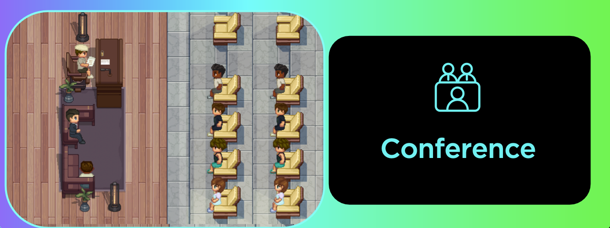
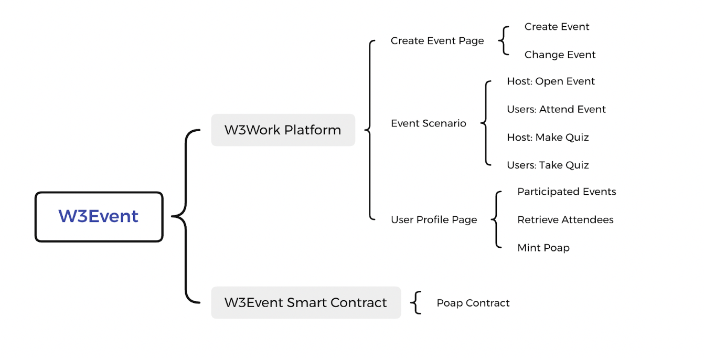
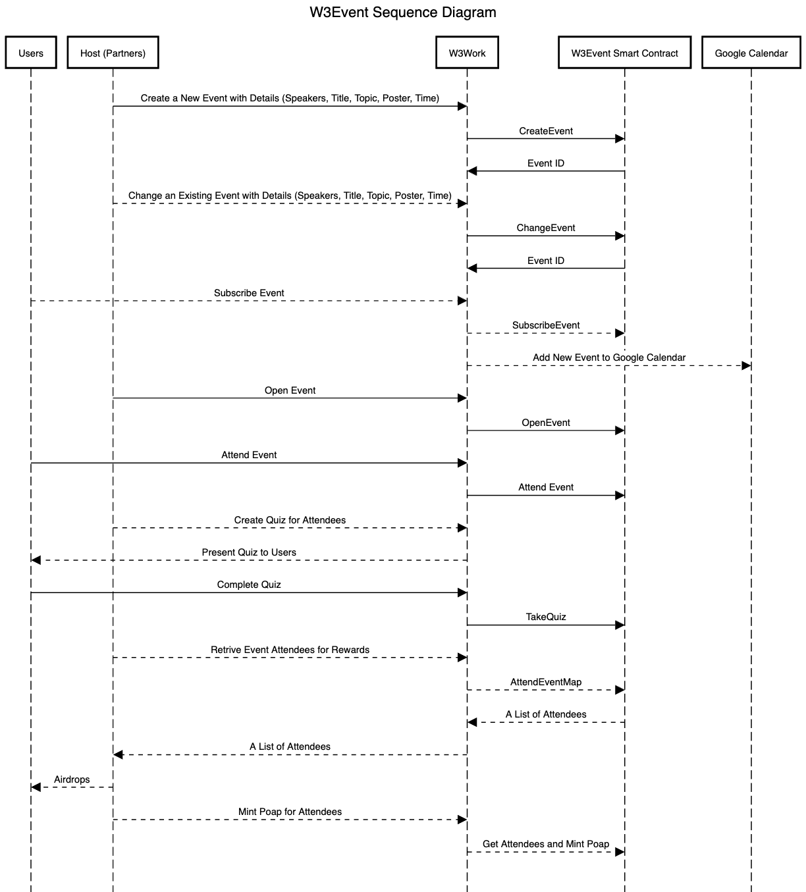

# w3.event

##What is W3event?

W3event is a decentralized event holding platform which aims to take AMAs, DAO meetings, Guild discussions and any other forms of gathering on chain. W3Event brings fully decentralized events data back to users and provides an immersive, interactive and  entertaining gathering experience.

##Problems

Current web3 events are unorganized, centralized and highly rely on web2 apps such as Twitter, Discord and other third party social media. The events organized had a hard time to collect participants information to plan for the next events. It is hard to retain its users and customers. 

Events participants also have little interaction with the organizer and guests and easily get bored during the event. Most people have a poor user experience during the meeting and lose the connection with the host afterwards.

##Solutions

- Decentralization: 100% decentralized events.
- Web3 Native: Event title, topic, host, speakers, time, participants, poster are recorded on chain automatically.
- Persistence: Events data is accessible forever on blockchain.
- Immersive: Users are meeting with each other in a delicate immersive metaverse environment to get motivated with the maximum engagement.
- Interactive: Interaction between host and guests, organizer and participants are amplified via interactive avatar operations, in-meeting quizzes, etc. 

##Architecture

##Sequence Diagram
Users of W3events usually follows the sequences below to hold a web3 event within our metaverse.

